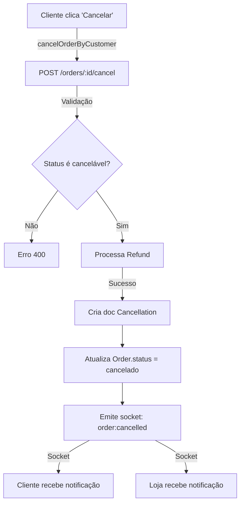
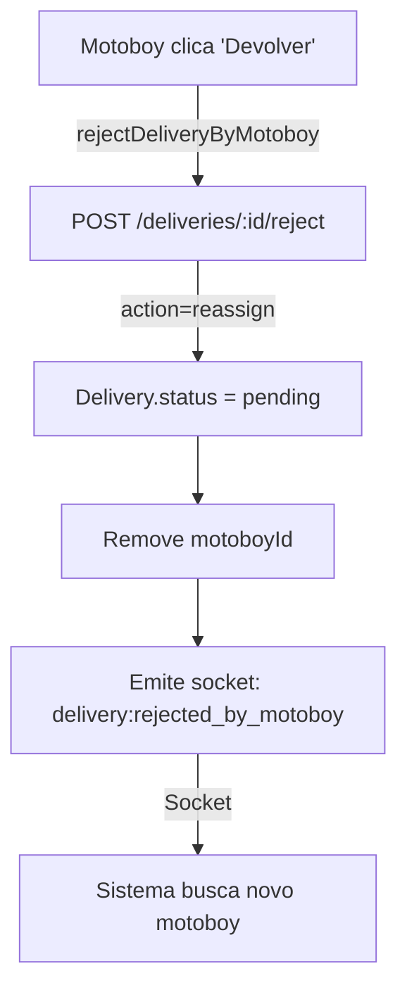
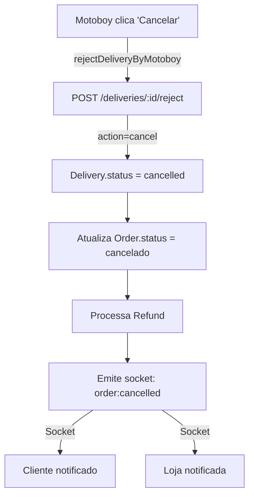

# Implementação de Cancelamentos e Rejeições

## Visão Geral

Este documento descreve a implementação completa do sistema de cancelamentos e rejeições para pedidos e entregas. O sistema suporta múltiplos cenários:

1. **Cliente cancela pedido** - Pedido com reembolso automático
2. **Motoboy rejeita entrega** - Retorno ao pool ou cancelamento
3. **Loja aceita pedido** - Transição para preparação
4. **Loja rejeita pedido** - Cancelamento com refund

## Arquitetura

### Modelo de Dados

**Cancellation.ts** - Rastreia todos os cancelamentos/rejeições:

```typescript
interface ICancellation {
  orderId: ObjectId;           // Pedido associado
  deliveryId?: ObjectId;       // Entrega associada (opcional)
  cancelledBy: 'customer' | 'motoboy' | 'store' | 'admin';
  reason: string;              // Descrição livre
  reasonCode: string;          // Código predefinido (ver abaixo)
  refundAmount?: number;       // Valor reembolsado
  refundStatus?: 'pending' | 'processed' | 'failed';
  createdAt: Date;
  updatedAt: Date;
}
```

**Reason Codes Predefinidos:**

```
// Customer
'customer_request'           - Cancelamento solicitado pelo cliente
'changed_mind'              - Cliente mudou de ideia
'wrong_address'             - Endereço errado
'items_unavailable'         - Itens não disponíveis

// Motoboy
'motoboy_rejected'          - Motoboy rejeitou a entrega
'unable_to_deliver'         - Impossível entregar
'customer_unavailable'      - Cliente não disponível
'technical_issue'           - Problema técnico

// Store
'store_rejected'            - Loja rejeitou o pedido
'store_closed'              - Loja fechada
'inventory_error'           - Erro de inventário
'high_demand'               - Alto volume de pedidos
'accept_timeout'            - Timeout de aceitação

// Admin
'fraud_detected'            - Fraude detectada
'policy_violation'          - Violação de política
```

### Controllers

**cancellationController.ts** - Lógica de negócio:

#### 1. Cancelamento por Cliente

```typescript
POST /orders/:id/cancel
Body: {
  reason: string;
  reasonCode?: string;  // Padrão: 'customer_request'
}

Response (200):
{
  success: true,
  orderId: string;
  status: 'cancelado';
  refundAmount: number;
  refundStatus: 'pending' | 'processed' | 'failed';
  cancellationId: string;
}
```

**Regras de Negócio:**
- Apenas pedidos em status 'criado', 'pago' ou 'enviado' podem ser cancelados
- Pedidos entregues não podem ser cancelados (deve fazer devolução)
- Reembolso é processado automaticamente
- Se há entrega associada, é cancelada também
- Notificações enviadas via socket para cliente e loja

#### 2. Rejeição de Entrega por Motoboy

```typescript
POST /deliveries/:id/reject
Body: {
  reason: string;
  reasonCode?: string;  // Padrão: 'motoboy_rejected'
  action: 'reassign' | 'cancel';
}

Response (200):
{
  success: true,
  deliveryId: string;
  status: 'pending' | 'cancelled';
  action: 'reassign' | 'cancel';
  reason: string;
}
```

**Ações Disponíveis:**

- **reassign**: Entrega volta para 'pending', outras motos podem reivindicar
  - Motoboy é removido
  - Sistema aguarda nova reivindicação

- **cancel**: Entrega é cancelada completamente
  - Pedido associado é cancelado
  - Cliente é reembolsado
  - Notificações enviadas

#### 3. Aceitação de Pedido por Loja

```typescript
POST /orders/:id/accept
Response (200):
{
  success: true,
  orderId: string;
  status: 'pago';
  acceptedAt: Date;
}
```

**Transição:** 'criado' → 'pago'
- Apenas lojistas podem aceitar
- Apenas pedidos em status 'criado'
- Cliente é notificado via socket

#### 4. Rejeição de Pedido por Loja

```typescript
POST /orders/:id/reject
Body: {
  reason: string;
  reasonCode?: string;  // Padrão: 'store_rejected'
}

Response (200):
{
  success: true,
  orderId: string;
  status: 'cancelado';
  reason: string;
  refundAmount: number;
  refundStatus: 'pending' | 'processed' | 'failed';
  cancellationId: string;
}
```

**Regras:**
- Apenas lojas podem rejeitar
- Apenas pedidos em 'criado' ou 'pago'
- Reembolso calculado e processado se pagamento foi capturado
- Entrega associada é cancelada
- Cliente é notificado

#### 5. Histórico de Cancelamentos

```typescript
GET /orders/:id/cancellations
Response (200):
{
  success: true;
  count: number;
  history: ICancellation[];
}
```

#### 6. Estatísticas de Cancelamento

```typescript
GET /orders/stats/cancellations
Response (200):
{
  success: true;
  byReason: [
    { _id: 'customer_request', count: 5, totalRefund: 150.00 },
    { _id: 'store_closed', count: 2, totalRefund: 60.00 },
    ...
  ];
  byRefundStatus: [
    { _id: 'processed', count: 15, total: 450.00 },
    { _id: 'failed', count: 1, total: 30.00 },
    ...
  ];
  totalCancellations: number;
}
```

### Socket Events

Novos eventos emitidos em tempo real:

```typescript
// Quando cliente cancela pedido
'order:cancelled' -> {
  orderId: string;
  status: 'cancelado';
  reason: string;
  reasonCode: string;
  refundAmount: number;
}

// Quando motoboy rejeita (reassign)
'delivery:rejected_by_motoboy' -> {
  deliveryId: string;
  reason: string;
  timestamp: Date;
}

// Quando entrega é cancelada
'delivery:cancelled' -> {
  deliveryId: string;
  status: 'cancelled';
  reason: string;
}

// Quando loja aceita pedido
'order:accepted_by_store' -> {
  orderId: string;
  status: 'aceito';
  timestamp: Date;
}

// Quando loja rejeita pedido
'order:rejected_by_store' -> {
  orderId: string;
  reason: string;
  timestamp: Date;
}
```

### Routes

**GET/POST /orders**

```typescript
POST /orders/:id/cancel          // Cliente cancela
POST /orders/:id/accept          // Loja aceita
POST /orders/:id/reject          // Loja rejeita
GET /orders/:id/cancellations    // Histórico
GET /orders/stats/cancellations  // Estatísticas
```

**GET/POST /deliveries**

```typescript
POST /deliveries/:id/reject      // Motoboy rejeita
```

## Frontend

### Hook: useCancellation

```typescript
const {
  loading,
  error,
  
  // Customer
  cancelOrder,
  
  // Motoboy
  rejectDelivery,
  
  // Store
  acceptOrder,
  rejectOrder,
  
  // Analytics
  getCancellationHistory,
  getCancellationStats,
} = useCancellation();
```

### Exemplo: Cancelar Pedido (Cliente)

```typescript
import useCancellation from '@/hooks/useCancellation';

export function OrderDetailPage() {
  const { cancelOrder, loading } = useCancellation();
  const [orderData, setOrderData] = useState(null);

  const handleCancel = async (reason: string) => {
    const result = await cancelOrder(
      orderData.id,
      reason,
      'customer_request'
    );

    if (result.success) {
      toast.success('Pedido cancelado com sucesso');
      // UI será atualizada via socket: order:cancelled
    } else {
      toast.error(result.error);
    }
  };

  return (
    <div>
      <button
        disabled={loading || orderData.status === 'entregue'}
        onClick={() => handleCancel('Cancelamento pelo cliente')}
      >
        {loading ? 'Processando...' : 'Cancelar Pedido'}
      </button>
    </div>
  );
}
```

### Exemplo: Rejeitar Entrega (Motoboy)

```typescript
export function DeliveryAcceptPage() {
  const { rejectDelivery, loading } = useCancellation();

  const handleReject = async (deliveryId: string, action: 'reassign' | 'cancel') => {
    const result = await rejectDelivery(
      deliveryId,
      'Impossível entregar',
      action,
      'unable_to_deliver'
    );

    if (result.success) {
      toast.success(result.message);
      // Volta para lista de entregas ou volta ao pool
    } else {
      toast.error(result.error);
    }
  };

  return (
    <div>
      <button
        disabled={loading}
        onClick={() => handleReject(deliveryId, 'reassign')}
      >
        Devolver ao Pool
      </button>
      <button
        disabled={loading}
        onClick={() => handleReject(deliveryId, 'cancel')}
      >
        Cancelar Entrega
      </button>
    </div>
  );
}
```

### Exemplo: Aceitar/Rejeitar Pedido (Loja)

```typescript
export function SellerOrderList() {
  const { acceptOrder, rejectOrder, loading } = useCancellation();

  return (
    <div>
      {orders.map(order => (
        <div key={order.id} className="order-card">
          <div className="order-actions">
            <button
              disabled={loading || order.status !== 'criado'}
              onClick={() => acceptOrder(order.id)}
            >
              Aceitar
            </button>
            <button
              disabled={loading || order.status !== 'criado'}
              onClick={() => rejectOrder(order.id, 'Loja fechada', 'store_closed')}
            >
              Rejeitar
            </button>
          </div>
        </div>
      ))}
    </div>
  );
}
```

## Fluxos de Integração com Socket

### Fluxo: Cliente Cancela Pedido



### Fluxo: Motoboy Rejeita Entrega (Reassign)



### Fluxo: Motoboy Rejeita Entrega (Cancel)



## Tratamento de Erros

Todos os endpoints retornam erros estruturados:

```typescript
{
  error: string;
  currentStatus?: string;  // Apenas em transição de status inválida
}
```

**Exemplo - Erro 400 (Transição Inválida):**
```json
{
  "error": "Pedido não pode ser cancelado no estado: entregue",
  "currentStatus": "entregue"
}
```

**Exemplo - Erro 403 (Permissão):**
```json
{
  "error": "Permissão negada"
}
```

**Exemplo - Erro 500 (Servidor):**
```json
{
  "error": "Erro ao cancelar pedido"
}
```

## Validações de Negócio

### Cancelamento por Cliente

- ✅ Status: 'criado', 'pago', 'enviado'
- ✗ Não pode: 'entregue', 'cancelado'
- ✅ Reembolso: Automático
- ✅ Cascata: Entrega cancelada se existir

### Rejeição de Entrega por Motoboy

- ✅ Status: 'assigned', 'picked'
- ✗ Não pode: 'pending', 'delivered', 'cancelled'
- ✅ Ações: 'reassign' (volta ao pool) ou 'cancel' (total)

### Aceitação por Loja

- ✅ Status: 'criado' apenas
- ✅ Transição: 'criado' → 'pago'
- ✅ Permissão: Apenas dono da loja

### Rejeição por Loja

- ✅ Status: 'criado' ou 'pago'
- ✗ Não pode: 'enviado', 'entregue', 'cancelado'
- ✅ Reembolso: Se pagamento foi capturado
- ✅ Cascata: Entrega cancelada se existir

## Métricas e Monitoramento

### Dashboard de Cancelamentos (Loja)

```typescript
GET /orders/stats/cancellations

Response:
{
  byReason: [
    { _id: 'customer_request', count: 12, totalRefund: 360.00 },
    { _id: 'store_closed', count: 3, totalRefund: 90.00 },
  ],
  byRefundStatus: [
    { _id: 'processed', count: 20, total: 600.00 },
    { _id: 'pending', count: 1, total: 30.00 },
    { _id: 'failed', count: 2, total: 60.00 },
  ],
  totalCancellations: 23
}
```

### Alertas Recomendados

1. Taxa de rejeição > 20% → Alerta para loja
2. Refund failed → Reprocess automático com retry
3. Motoboy com 5+ rejeições em 24h → Suspensão temporária
4. Pedido não aceito > 5min → Auto-cancel com refund

## Testing

### Test Cases

```typescript
// Cliente cancela pedido
describe('Customer Cancel Order', () => {
  test('Should cancel paid order and process refund');
  test('Should not cancel delivered order');
  test('Should cancel associated delivery');
  test('Should emit socket event to customer and store');
  test('Should fail if not order owner');
});

// Motoboy rejeita entrega
describe('Motoboy Reject Delivery', () => {
  test('Should reassign delivery to pool');
  test('Should cancel order if action=cancel');
  test('Should only allow assigned/picked status');
  test('Should emit socket events');
});

// Loja aceita/rejeita
describe('Store Order Operations', () => {
  test('Should accept criado->pago transition');
  test('Should reject with refund');
  test('Should validate store ownership');
});
```

## Integração com Payment Gateway

Para implementar reembolsos reais:

```typescript
// Em cancellationController.ts
import { PaymentService } from '../services/PaymentService';

try {
  const refund = await PaymentService.refund({
    transactionId: order.paymentId,
    amount: refundAmount,
  });
  refundStatus = 'processed';
} catch (error) {
  refundStatus = 'failed';
  // Implementar retry automático
}
```

## Próximos Passos

1. ✅ Modelo Cancellation.ts
2. ✅ Controllers com lógica de negócio
3. ✅ Routes/endpoints
4. ✅ Socket events
5. ✅ Hook frontend
6. 🔄 UI Components
   - Modal de confirmação com opções de reason
   - Cards de status de cancelamento
   - Dashboard de estatísticas
7. 🔄 Testing completo
8. 🔄 Integração com payment gateway real
9. 🔄 Notificações (email, SMS)
10. 🔄 Auto-cancel com timeouts

## Comando para Deploy

```bash
# Backend
npm run build
npm run start

# Frontend
npm run build
```

## Monitoramento de Produção

- Monitor taxa de cancelamentos por hora
- Alertar se refund failure > 5%
- Track tempo médio até refund processado
- Monitor socket event delivery rate

## Estrutura de Erros Completa

```typescript
// Erro 400: Validação
{
  error: string;
  currentStatus?: string;
  expected?: string[];
}

// Erro 403: Permissão
{
  error: 'Permissão negada'
}

// Erro 404: Não encontrado
{
  error: string;
}

// Erro 500: Servidor
{
  error: string;
}
```
